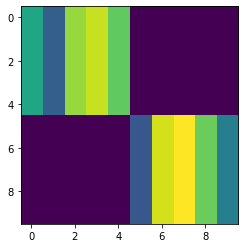
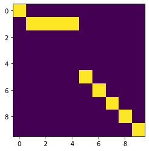
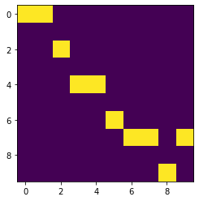
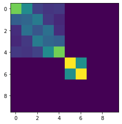
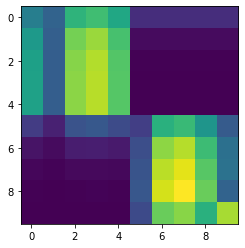

# Pytorch-Struct

[](https://travis-ci.org/harvardnlp/pytorch-struct)
[](https://coveralls.io/github/harvardnlp/pytorch-struct?branch=master)

<p align="center">
  
  </p>


A library of tested, GPU implementations of core structured prediction algorithms for deep learning applications.
(or an implementation of <a href="https://www.cs.jhu.edu/~jason/papers/eisner.spnlp16.pdf">Inside-Outside and Forward-Backward Algorithms Are Just Backprop"<a/>)


```python
!pip install -qU git+https://github.com/harvardnlp/pytorch-struct
!pip install -q matplotlib
```


```python
import torch
from torch_struct import DepTree, LinearChain, MaxSemiring, SampledSemiring
import matplotlib.pyplot as plt
```


```python
vals = torch.zeros(2, 10, 10) + 1e-5
vals[:, :5, :5] = torch.rand(5) 
vals[:, 5:, 5:] = torch.rand(5) 
vals = vals.log()
plt.imshow(vals[0])
```


    <matplotlib.image.AxesImage at 0x7f4c2ee80320>


```python
plt.imshow(vals.softmax(-1)[0])
```


    <matplotlib.image.AxesImage at 0x7f4c2e7355f8>





```python
# Marginals
marginals = DepTree().marginals(vals)
plt.imshow(marginals[0].detach())
```


    <matplotlib.image.AxesImage at 0x7f4c2e71e2b0>


```python
# Argmax
argmax = DepTree(MaxSemiring).marginals(vals)
plt.imshow(argmax.detach()[0])
```


    <matplotlib.image.AxesImage at 0x7f4c29e6acf8>





```python
# Scoring and enumeration (forward / inside)
log_partition = DepTree().sum(vals)
max_score = DepTree(MaxSemiring).sum(vals)
max_score = DepTree().score(argmax, vals)
```


```python
# Sampling 
sample = DepTree(SampledSemiring).marginals(vals)
plt.imshow(sample.detach()[0])
```


    <matplotlib.image.AxesImage at 0x7f4c29e56198>





```python
# Padding/Masking built into library.

marginals = DepTree().marginals(vals,
                                lengths=torch.tensor([10, 7]))
plt.imshow(marginals[0].detach())
plt.show()
plt.imshow(marginals[1].detach())
```


    <matplotlib.image.AxesImage at 0x7f4c2857d6a0>





```python
# Many other structured prediction approaches
chain = torch.zeros(2, 10, 10, 10) + 1e-5
chain[:, :, :, :] = vals.unsqueeze(-1).exp()
chain[:, :, :, :] += torch.eye(10, 10).view(1, 1, 10, 10) 
chain[:, 0, :, 0] = 1
chain[:, -1,9, :] = 1
chain = chain.log()

marginals = LinearChain().marginals(chain)
plt.imshow(marginals.detach()[0].sum(-1))
```


    <matplotlib.image.AxesImage at 0x7f4c28504940>





## Library

Current algorithms implemented:

* Linear Chain (CRF / HMM)
* Semi-Markov (CRF / HSMM)
* Dependency Parsing (Projective and Non-Projective)
* CKY (CFG)

Design Strategy:

1) Minimal implementatations. Most are 10 lines.
2) Batched for GPU.
3) Code can be ported to other backends

Semirings:

* Log Marginals
* Max and MAP computation
* Sampling through specialized backprop

