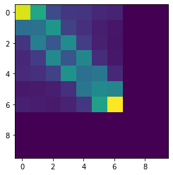
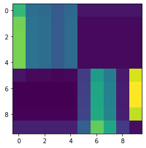

# Pytorch-Struct

[](https://travis-ci.org/harvardnlp/pytorch-struct)
[](https://coveralls.io/github/harvardnlp/pytorch-struct?branch=master)

<p align="center">
  
  </p>


A library of tested, GPU implementations of core structured prediction algorithms for deep learning applications.
(or an implementation of <a href="https://www.cs.jhu.edu/~jason/papers/eisner.spnlp16.pdf">Inside-Outside and Forward-Backward Algorithms Are Just Backprop"<a/>)


## Getting Started


```python
!pip install -qU git+https://github.com/harvardnlp/pytorch-struct
!pip install -q matplotlib
```


```python
import torch
from torch_struct import DependencyCRF, LinearChainCRF
import matplotlib.pyplot as plt
def show(x): plt.imshow(x.detach())
```


```python
# Make some data.
vals = torch.zeros(2, 10, 10) + 1e-5
vals[:, :5, :5] = torch.rand(5)
vals[:, 5:, 5:] = torch.rand(5) 
dist = DependencyCRF(vals.log())
show(dist.log_potentials[0])
```


```python
# Compute marginals
show(dist.marginals[0])
```


```python
# Compute argmax
show(dist.argmax.detach()[0])
```


```python
# Compute scoring and enumeration (forward / inside)
log_partition = dist.partition
max_score = dist.log_prob(dist.argmax)
```


```python
# Compute samples 
show(dist.sample((1,)).detach()[0, 0])
```


```python
# Padding/Masking built into library.
dist = DependencyCRF(vals, lengths=torch.tensor([10, 7]))
show(dist.marginals[0])
plt.show()
show(dist.marginals[1])
```





```python
# Many other structured prediction approaches
chain = torch.zeros(2, 10, 10, 10) + 1e-5
chain[:, :, :, :] = vals.unsqueeze(-1).exp()
chain[:, :, :, :] += torch.eye(10, 10).view(1, 1, 10, 10) 
chain[:, 0, :, 0] = 1
chain[:, -1,9, :] = 1
chain = chain.log()

dist = LinearChainCRF(chain)
show(dist.marginals.detach()[0].sum(-1))
```





## Library

Current distributions implemented:

* LinearChainCRF 
* SemiMarkovCRF 
* DependencyCRF 
* TreeCRF 


Extensions:

* Integration with `torchtext`, `pytorch-transformers`, `dgl`
* Adapters for generative structured models (CFG / HMM / HSMM)
* Common tree structured parameterizations TreeLSTM / SpanLSTM

Design Strategy:

1) Minimal efficient python implementatations. 
2) Batched for GPU.
3) Code can be ported to other backends


## Low-level API: 

Everything implemented through semiring dynamic programming. 

* Log Marginals
* Max and MAP computation
* Sampling through specialized backprop
* Entropy and first-order semirings. 


## Examples

* BERT <a href="https://github.com/harvardnlp/pytorch-struct/blob/master/notebooks/BertTagger.ipynb">Part-of-Speech</a> 
* BERT <a href="https://github.com/harvardnlp/pytorch-struct/blob/master/notebooks/BertDependencies.ipynb">Dependency Parsing</a>
* <a href="https://github.com/harvardnlp/pytorch-struct/blob/master/notebooks/Unsupervised_CFG.ipynb">Unsupervised Learning</a> 
* <a href="https://github.com/harvardnlp/pytorch-struct/blob/master/examples/tree.py">Structured VAE </a>
